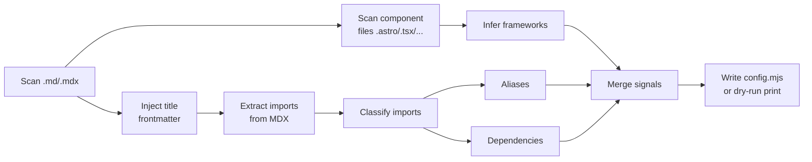

## Context

Users who want to use fea-docs with custom components, framework adapters, and third-party dependencies currently must author `fea-docs.config.mjs` by hand. This requires knowing the config schema, manually discovering which component directories need aliases, which frameworks are implied by the MDX content, and which npm packages must be declared as dependencies.

The existing `inferFrameworksFromMdxGraph` module already has import-extraction logic, and the `injectFrontmatterTitle` function already injects missing frontmatter titles. These capabilities can be composed into a setup command that bootstraps a config file for the user to review and adjust.

## Problem Statement

Setting up fea-docs for a non-trivial project requires:

1. Discovering which framework adapters are needed (React, Svelte, Vue, etc.) by inspecting imports and component files.
2. Finding import aliases used in MDX files and mapping them to real directories.
3. Identifying third-party npm packages imported by components.
4. Ensuring all doc files have frontmatter `title` fields for consistent navigation labels.
5. Writing the `fea-docs.config.mjs` file with correct syntax.

This manual process is error-prone, especially for large repositories, and creates friction for new users evaluating fea-docs.

## Goal

Provide a `fea-docs init` command that scans the current directory, injects missing frontmatter titles, discovers frameworks/aliases/dependencies from MDX imports and component files, and writes a `fea-docs.config.mjs` for the user to review.

## Non-Goals

- Auto-regenerating config on file changes (one-shot scaffold only).
- Validating that the generated config produces a working build (user reviews first).
- Modifying an existing `fea-docs.config.mjs` (command refuses if one exists).
- Deep graph traversal of the entire import tree for framework inference (the existing `inferFrameworksFromMdxGraph` already does this at runtime; the init command uses a lighter heuristic).
- Supporting config formats other than `.mjs` (the init command always generates ESM `.mjs`).
- Installing dependencies or running `npm install` (scaffold only).

## User Stories

1. As a new user, I want to run `fea-docs init` from my project root and get a draft `fea-docs.config.mjs`, so that I can review and edit it before running `fea-docs start`.
2. As a docs author, I want `fea-docs init` to inject a `title` in the frontmatter of any doc file that lacks one, so that navigation labels are consistent from the start.
3. As a docs author, I want framework adapters auto-detected from MDX imports and component file extensions, so that I don't need to know which frameworks fea-docs supports.
4. As a docs author, I want import aliases like `@components/` auto-discovered when they map to real directories, so that I don't need to trace imports manually.
5. As a docs author, I want third-party npm dependencies auto-detected from MDX imports, so that the config includes packages my components need.
6. As a docs author, I want to run `fea-docs init --dry-run` to preview the results without writing anything, so that I can verify what will be generated.
7. As a docs author, I want a clear warning if a `fea-docs.config.mjs` already exists, so that I don't accidentally overwrite my config.
8. As a docs author, I want a summary printed after init showing what was discovered, so that I understand what the generated config contains.

## Proposed Solution

### Command: `fea-docs init`

```
fea-docs init [options]
```

Options:

| Flag | Type | Default | Description |
|------|------|---------|-------------|
| `--dry-run` | boolean | false | Preview results without writing files |
| `--root <path>` | string | `process.cwd()` | Scan root directory |

### Scan pipeline



### Classification rules

**Aliases** — For each unique non-relative import specifier root (first path segment):

1. If the root starts with `@`, strip the `@` prefix; if the resulting name matches a directory in CWD, propose alias: `@name → /abs/path/to/name`
2. If the root itself (e.g. `@components`) exists as a directory in CWD, propose alias: `@components → /abs/path/to/@components`
3. Aliases are written as absolute paths using `path.join(root, dir)` in the generated config

**Dependencies** — For specifiers that are neither relative (`.` prefix) nor classified as aliases:

1. Check if the package root exists in `node_modules/<root>/package.json`
2. If found, read its `version` field and use it as the version constraint
3. If not found or not installed, use `'*'` as the version string
4. Known framework packages (`react`, `vue`, `svelte`, `solid-js`, `@builder.io/qwik`) are excluded from the `dependencies` output since fea-docs manages them via adapters

**Frameworks** — Inferred from:

1. Import specifier signals: `react`/`react-dom` → `react`, `svelte` → `svelte`, `vue` → `vue`, `solid-js` → `solid`, `@builder.io/qwik` → `qwik`
2. Component file extensions: `.svelte` → `svelte`, `.vue` → `vue`
3. Ambiguous `.tsx`/`.jsx` files with no confident framework signal → `react` + `solid` + `qwik` fallback
4. De-duplicated across all signals

### Output format

```mjs
// Auto-generated by `fea-docs init` — review before using.
import { fileURLToPath } from 'node:url';
import path from 'node:path';

const __dirname = path.dirname(fileURLToPath(import.meta.url));
const root = path.resolve(__dirname, '.');

/** @type {import('fea-docs').FeaDocsConfig} */
export default {
  frameworks: ['react'],
  aliases: {
    '@components': path.join(root, 'components'),
    '@react-lib': path.join(root, 'react-lib'),
  },
  dependencies: {
    '@codesandbox/sandpack-react': '^2.20.0',
  },
};
```

The generated file includes a JSDoc `@type` annotation for editor autocompletion.

## Deep Module Impact

- **New file:** `src/cli/commands/init.ts` — the init command implementation (~150 lines).
- **Modified:** `src/cli/program.ts` — add `import { initCommand }` and `program.addCommand(initCommand())`.
- **No changes needed:** `src/types.ts`, `src/index.ts`, `src/content-graph/parser.ts` (reuses `deriveLabel` and `injectFrontmatterTitle`).

## Acceptance Criteria

1. Running `fea-docs init` in the `example/` directory produces a config file identical in substance to the existing `example/fea-docs.config.mjs` (frameworks: react+svelte, aliases: `@react-lib`, `@svelte-lib`, `@astro-lib`, `@components`, deps: `@codesandbox/sandpack-react`).
2. Running `fea-docs init --dry-run` in the example directory prints the intended config to stdout without writing any files.
3. Running `fea-docs init` in a directory with only `.md` files produces a config with no frameworks, aliases, or dependencies.
4. Running `fea-docs init` in a directory with an existing `fea-docs.config.mjs` prints a warning and exits without modifying the file.
5. Files without a frontmatter `title` have one injected after `fea-docs init` runs.
6. The generated config is valid ESM and can be loaded by `resolveConfig()`.

## Edge Cases

- **No `.md`/`.mdx` files** → print "No documentation files found" and skip writing config.
- **Only `.md` files** → no imports to parse; config has empty `frameworks`, `aliases`, `dependencies`.
- **No MDX imports** → empty `aliases` and `dependencies`.
- **Uninstalled npm packages** → version falls back to `'*'`, printed as a warning.
- **Imports with unusual specifiers** (e.g., `'@scope/package'`, `'~lib/utils'`) → classified per the prefix rules.
- **Existing `fea-docs.config.mjs`** → warning + exit; user must delete or rename first.

## Testing Decisions

- Unit test: `--dry-run` does not write the config file.
- Unit test: import classification separates aliases from dependencies correctly.
- Unit test: framework inference from specifiers and extensions.
- Manual: run `fea-docs init` in the example directory and verify output matches expectations.

## Risks and Mitigations

- **Risk:** Alias heuristic may miss valid aliases or propose directories that aren't meant to be aliases.
  - **Mitigation:** This is a scaffold for review — the user is expected to review and edit before use. The `--dry-run` flag lets them preview.
- **Risk:** Dependency version from `node_modules` may be a transitive dep or different from the user's intent.
  - **Mitigation:** Version is a best-effort hint; user reviews the config. Packages not found in `node_modules` get `'*'`.
- **Risk:** Frontmatter title injection mutates files on disk, which may be surprising.
  - **Mitigation:** The existing `injectFrontmatterTitle` is already used during normal `start`/`build` flows. The init command makes this explicit and the user can revert with git.

## Proposed Vertical Slices (Tracer Bullets)

1. **Title:** `fea-docs init` command scaffold with dry-run and guard
   - **Type:** AFK
   - **Blocked by:** None
   - **What this slice proves:** The command registers, refuses to overwrite existing config, supports `--dry-run` that prints without writing, works with empty directory.
   - **Acceptance checks:**
     - `fea-docs init --help` shows the command and options.
     - Running in a dir with `fea-docs.config.mjs` prints warning and exits with code 0.
     - `--dry-run` prints summary and intended config to stdout; no file is created.
     - Running in a dir with no `.md`/`.mdx` files prints "No documentation files found" and exits.

2. **Title:** Frontmatter title injection during init
   - **Type:** AFK
   - **Blocked by:** #1
   - **What this slice proves:** Files without a `title` in frontmatter get one injected; files with an existing title are left untouched.
   - **Acceptance checks:**
     - A `.md` file without frontmatter gets `title: '<filename-stem>'` prepended.
     - A file with frontmatter but no `title` gets `title: '<derived-label>'` inserted as first key.
     - A file with an existing `title` is not modified.
     - The count of modified files is printed in the summary.

3. **Title:** Import classification, alias/dependency/framework detection, and config generation
   - **Type:** AFK
   - **Blocked by:** #1
   - **What this slice proves:** MDX imports are parsed, classified into aliases/dependencies/frameworks, and written to `fea-docs.config.mjs` in correct ESM format.
   - **Acceptance checks:**
     - Imports from `@components/Code.astro` and `@lib/utils.ts` with corresponding directories result in alias entries.
     - Imports from `react`, `svelte` result in framework entries.
     - Imports from `@codesandbox/sandpack-react` result in a dependency entry.
     - The generated file is valid ESM with `@type` JSDoc annotation.
     - Running `fea-docs init` in the `example/` directory produces a config matching the existing one (frameworks, aliases, deps).

## Dependency Graph (summary)

- Foundation: #1
- Content pipeline: #2, #3 (parallel after #1)
- Integration: no further slices needed (these three cover the full feature)

## Review Questions

1. Should the command also validate that every alias root actually exists before writing? (Current plan: yes — only existing directories are proposed as aliases.)
2. Should `--root` be accepted on the init command, or always use CWD? (Proposed: yes, `--root <path>` for scanning a different directory.)
3. Should we add an `--overwrite` flag to allow replacing an existing config without manually deleting it?

---

## Implementation Plan

### Ticket 1: Create `init` command scaffold (AFK)

**What this proves:** The command registers in the CLI, refuses to overwrite an existing config, supports `--dry-run`, prints a helpful message when no docs are found, and handles `--root`.

**Files to modify:**
- `src/cli/program.ts` — import and register the command
- `src/cli/commands/init.ts` — new file, command + scaffold

**Changes:**

`src/cli/program.ts` — add after setup import:
```ts
import { initCommand } from './commands/init.js';
// ... after setup.addCommand(...)
program.addCommand(initCommand());
```

`src/cli/commands/init.ts` — command definition + scaffold:
```ts
import { Command } from 'commander';
import fs from 'node:fs';
import path from 'node:path';
import pc from 'picocolors';
import fg from 'fast-glob';
import matter from 'gray-matter';
import { deriveLabel, injectFrontmatterTitle } from '../../content-graph/parser.js';
import { DEFAULT_IGNORE_GLOBS } from '../../content-graph/defaults.js';

const IMPORT_RE = /(?:^|\n)\s*import\s+(?:[^'"\n]*?\s+from\s+)?['"]([^'"]+)['"]/g;

interface InitOptions {
  root: string;
  dryRun: boolean;
}

export function initCommand(): Command {
  return new Command('init')
    .description('Initialize a fea-docs.config.mjs in the current directory')
    .option('--dry-run', 'Preview the generated config without writing files')
    .option('--root <path>', 'Scan root directory (default: cwd)')
    .action(async (opts) => {
      try {
        await runInit({
          root: opts.root ? String(opts.root) : process.cwd(),
          dryRun: Boolean(opts.dryRun),
        });
      } catch (err) {
        console.error(pc.red('Error:'), err instanceof Error ? err.message : String(err));
        process.exit(1);
      }
    });
}
```

**`runInit()` logic — stage 1 (guard + scan only):**

```ts
async function runInit(options: InitOptions): Promise<void> {
  const { root, dryRun } = options;

  // Guard: existing config
  const configPath = path.join(root, 'fea-docs.config.mjs');
  if (fs.existsSync(configPath)) {
    console.log(pc.yellow('fea-docs.config.mjs already exists — delete it first to regenerate.'));
    return;
  }

  // Scan doc files
  const docFiles = await fg(['**/*.md', '**/*.mdx'], {
    cwd: root,
    ignore: DEFAULT_IGNORE_GLOBS,
    dot: true,
  });

  if (docFiles.length === 0) {
    console.log(pc.yellow('No documentation files found.'));
    return;
  }

  // (stage 2 & 3 add logic here)

  console.log(pc.cyan('\nSummary:'));
  console.log(`  Doc files found: ${docFiles.length}`);
}
```

**Acceptance checks:**
- `fea-docs init --help` shows the command with `--dry-run` and `--root` options.
- Running in a dir with `fea-docs.config.mjs` prints warning and exits cleanly (code 0).
- `--dry-run` prints to stdout without creating the config file.
- Running in a dir with no `.md`/`.mdx` files prints "No documentation files found" and exits.
- `--root /some/other/dir` scans that directory instead of CWD.

---

### Ticket 2: Frontmatter title injection (AFK)

**Blocked by:** Ticket 1

**What this proves:** Files without a `title` in frontmatter get one injected via the existing `injectFrontmatterTitle` / `deriveLabel` functions. Files with an existing title are left untouched.

**Files to modify:**
- `src/cli/commands/init.ts` — add title-injection logic inside `runInit()`

**Changes:**

Inside `runInit()`, after scanning doc files:

```ts
// Stage 2: Inject frontmatter titles where missing
let titleInjected = 0;
const mdxFiles: string[] = [];

for (const relPath of docFiles) {
  const absPath = path.join(root, relPath);
  const raw = fs.readFileSync(absPath, 'utf-8');
  const { data: frontmatter, content } = matter(raw);
  const label = deriveLabel(frontmatter, content, relPath);

  if (!dryRun) {
    const updated = injectFrontmatterTitle(absPath, raw, label);
    if (updated !== raw) titleInjected++;
  } else {
    // Simulate: count files that would be mutated
    if (!frontmatter.title || !String(frontmatter.title).trim()) {
      titleInjected++;
    }
  }

  if (relPath.endsWith('.mdx')) {
    mdxFiles.push(relPath);
  }
}
```

**Acceptance checks:**
- A `.md` file without any frontmatter gets `title: '<stem>'` prepended as `---\ntitle: <label>\n---`.
- A file with frontmatter but missing `title` gets `title: '<label>'` as the first key.
- A file with an existing `title` field is not modified.
- The count of injected titles is printed in the summary.
- `--dry-run` shows the correct count without mutating files.

---

### Ticket 3: Import classification, alias/dependency/framework discovery, and config generation (AFK)

**Blocked by:** Ticket 1

**What this proves:** MDX imports are parsed, specifiers are classified into aliases/dependencies/framework signals, component files on the filesystem contribute additional framework signals, and a valid `fea-docs.config.mjs` is written (or printed in dry-run).

**Files to modify:**
- `src/cli/commands/init.ts` — add import scanning, classification, component scan, config generation, summary

**Changes:**

**Component file scan** (after title injection):

```ts
// Scan for component files (non-doc source files)
const componentExts = ['.astro', '.tsx', '.jsx', '.svelte', '.vue'];
const componentFiles = await fg(
  componentExts.map(e => `**/*${e}`),
  { cwd: root, ignore: DEFAULT_IGNORE_GLOBS, dot: true },
);
```

**Import extraction from MDX + component files:**

```ts
// Extract all import specifiers from MDX and component files
const allSpecifiers = new Set<string>();
const scanTargets = [
  ...mdxFiles,
  ...componentFiles.filter(f =>
    /\.(astro|tsx|jsx|svelte|vue)$/i.test(f)
  ),
];

for (const relPath of scanTargets) {
  const absPath = path.join(root, relPath);
  const content = fs.readFileSync(absPath, 'utf-8');
  for (const match of content.matchAll(IMPORT_RE)) {
    const specifier = match[1]?.trim();
    if (specifier) allSpecifiers.add(specifier);
  }
}
```

**Classification logic:**

```ts
// Classification
const frameworks = new Set<string>();
const aliases: Record<string, string> = {};
const dependencies: Record<string, string> = {};
const unresolved: string[] = [];

// Package roots that are framework adapters (excluded from deps)
const frameworkPackageRoots = new Set([
  'react', 'react-dom', 'solid-js', 'vue', 'svelte', '@builder.io/qwik',
]);

for (const specifier of allSpecifiers) {
  if (specifier.startsWith('.')) continue; // relative, skip

  const rootSeg = specifier.split('/')[0]!;

  // Framework signals from direct imports
  if (specifier === 'react' || specifier === 'react-dom' || specifier === 'react/jsx-runtime') {
    frameworks.add('react');
  } else if (specifier === 'solid-js' || specifier === 'solid-js/web') {
    frameworks.add('solid');
  } else if (specifier === 'vue') {
    frameworks.add('vue');
  } else if (specifier === 'svelte') {
    frameworks.add('svelte');
  } else if (specifier === '@builder.io/qwik' || specifier === '@builder.io/qwik-city') {
    frameworks.add('qwik');
  }

  // Extension-based signals
  const ext = path.extname(specifier).toLowerCase();
  if (ext === '.svelte') frameworks.add('svelte');
  if (ext === '.vue') frameworks.add('vue');

  // Alias detection
  let aliasTarget: string | null = null;
  if (rootSeg.startsWith('@')) {
    const candidate = path.join(root, rootSeg.slice(1));
    if (fs.existsSync(candidate) && fs.statSync(candidate).isDirectory()) {
      aliasTarget = candidate;
    } else {
      const fullAlias = path.join(root, rootSeg);
      if (fs.existsSync(fullAlias) && fs.statSync(fullAlias).isDirectory()) {
        aliasTarget = fullAlias;
      }
    }
  } else if (rootSeg.startsWith('~')) {
    const candidate = path.join(root, rootSeg.slice(1));
    if (fs.existsSync(candidate) && fs.statSync(candidate).isDirectory()) {
      aliasTarget = candidate;
    }
  }

  if (aliasTarget) {
    aliases[rootSeg] = aliasTarget;
    continue;
  }

  // Skip framework packages (they're managed by the adapter)
  if (frameworkPackageRoots.has(rootSeg)) continue;

  // Dependency detection
  const pkgRoot = specifier.startsWith('@')
    ? `${rootSeg}/${specifier.split('/')[1]}`
    : rootSeg;
  const pkgJsonPath = path.join(root, 'node_modules', pkgRoot, 'package.json');

  if (fs.existsSync(pkgJsonPath)) {
    try {
      const pkg = JSON.parse(fs.readFileSync(pkgJsonPath, 'utf-8'));
      dependencies[specifier] = `^${pkg.version}`;
    } catch {
      dependencies[specifier] = '*';
    }
  } else {
    dependencies[specifier] = '*';
    unresolved.push(specifier);
  }
}
```

**Framework fallback for ambiguous JSX/TSX:**

```ts
const hasJsxTsx = componentFiles.some(f => /\.tsx?$/.test(f));
const hasConfidentSignal =
  frameworks.has('react') || frameworks.has('solid') || frameworks.has('qwik');

if (hasJsxTsx && !hasConfidentSignal) {
  frameworks.add('react');
  frameworks.add('solid');
  frameworks.add('qwik');
}

// Also add frameworks from component file extensions
if (componentFiles.some(f => f.endsWith('.svelte'))) frameworks.add('svelte');
if (componentFiles.some(f => f.endsWith('.vue'))) frameworks.add('vue');
```

**Config generation:**

```ts
function generateConfig(data: {
  frameworks: string[];
  aliases: Record<string, string>;
  dependencies: Record<string, string>;
  root: string;
}): string {
  const { frameworks, aliases, dependencies, root } = data;
  const lines: string[] = [];

  lines.push('// Auto-generated by `fea-docs init` — review before using.');
  lines.push("import { fileURLToPath } from 'node:url';");
  lines.push("import path from 'node:path';");
  lines.push('');
  lines.push("const __dirname = path.dirname(fileURLToPath(import.meta.url));");
  lines.push("const root = path.resolve(__dirname, '.');");
  lines.push('');
  lines.push("/** @type {import('fea-docs').FeaDocsConfig} */");
  lines.push('export default {');

  if (frameworks.length > 0) {
    lines.push(`  frameworks: [${frameworks.map(f => `'${f}'`).join(', ')}],`);
  }

  if (Object.keys(aliases).length > 0) {
    lines.push('  aliases: {');
    for (const [key, val] of Object.entries(aliases).sort()) {
      const rel = path.relative(root, val);
      lines.push(`    '${key}': path.join(root, '${rel}'),`);
    }
    lines.push('  },');
  }

  if (Object.keys(dependencies).length > 0) {
    lines.push('  dependencies: {');
    for (const [key, val] of Object.entries(dependencies).sort()) {
      lines.push(`    '${key}': '${val}',`);
    }
    lines.push('  },');
  }

  lines.push('};');
  return lines.join('\n') + '\n';
}
```

**Write or dry-run + summary:**

```ts
const configContent = generateConfig({
  frameworks: Array.from(frameworks).sort(),
  aliases,
  dependencies,
  root,
});

if (dryRun) {
  console.log(pc.cyan('\n=== Generated fea-docs.config.mjs (dry-run) ===\n'));
  console.log(configContent);
} else {
  fs.writeFileSync(configPath, configContent, 'utf-8');
  console.log(pc.green(`\nWrote ${configPath}`));
}

console.log(pc.cyan('\nSummary:'));
console.log(`  Doc files found:        ${docFiles.length}`);
console.log(`  Titles injected:        ${titleInjected}`);
console.log(`  Component files found:  ${componentFiles.length}`);
console.log(`  Frameworks detected:    ${Array.from(frameworks).join(', ') || '(none)'}`);
console.log(`  Aliases discovered:     ${Object.keys(aliases).length}`);
console.log(`  Dependencies found:     ${Object.keys(dependencies).length}`);

if (unresolved.length > 0) {
  console.log(pc.yellow(`\n  Warning: ${unresolved.length} import(s) not found in node_modules (version set to '*')`));
  for (const spec of unresolved) {
    console.log(pc.yellow(`    ${spec}`));
  }
}
```

**Acceptance checks:**
- Running `fea-docs init` in the `example/` directory detects `react`, `svelte`, `@components`, `@react-lib`, `@svelte-lib`, `@astro-lib`, and `@codesandbox/sandpack-react`.
- Running in a dir with only `.md` files produces a config with empty frameworks/aliases/dependencies.
- Config file is valid ESM and can be loaded by `resolveConfig()`.
- Dry-run shows the exact same content as would be written.
- Component file extensions correctly influence framework inference.
- Unresolved imports appear as warnings in the summary.

---

### Ticket 4: Tests (AFK)

**Blocked by:** Tickets 1, 2, 3

**What this proves:** All init behaviors are covered by automated tests.

**Files to create:**
- `src/__tests__/init.test.ts`

**Test coverage:**

| Test | Description |
|------|-------------|
| Guard existing config | Create `fea-docs.config.mjs` in temp dir, run init, assert warning message, no overwrite |
| Dry-run doesn't write | Run `--dry-run`, assert no `fea-docs.config.mjs` created after |
| Empty dir | Run in dir with no md/mdx, assert "No documentation files found" |
| Title injection | Dir with md file missing title → file has title after init |
| Title injection dry-run | Dry-run shows count, file not mutated |
| Existing title preserved | Dir with md file that has title → file unchanged |
| Framework from import | Dir with mdx importing `react` → config has `frameworks: ['react']` |
| Framework from `.svelte` file | Dir with `.svelte` component file → config has `frameworks: ['svelte']` |
| Alias detection | Dir with `react-lib/` + mdx importing `@react-lib/Foo` → alias entry written |
| Dependency detection | Dir with mdx importing an npm package → dependency entry written |
| Dependency version | If package installed in node_modules, version matches |
| Config format valid | Generated file can be imported (syntax-valid ESM) |
| Full example dir | Run in the repo's `example/` dir → matches expected output |

**Test fixtures approach:**
Use `fs.mkdtempSync` / `fs.mkdtemp` to create temp directories, write fixture files, run the init logic, then assert file contents. Clean up after each test.

---

### File change summary

| File | Action | Lines |
|------|--------|-------|
| `src/cli/commands/init.ts` | **Create** | ~170 (scaffold + full logic) |
| `src/cli/program.ts` | **Edit** | +2 (import + register) |
| `src/__tests__/init.test.ts` | **Create** | ~120 (test cases) |

No changes needed to `src/types.ts`, `src/index.ts`, or any other existing module. The implementation reuses `deriveLabel`, `injectFrontmatterTitle`, the `IMPORT_RE` regex pattern, and `DEFAULT_IGNORE_GLOBS` — all already exported or trivially accessible.

---

### Dependency graph

```
Ticket 1 (command scaffold)
  ├── Ticket 2 (title injection) — parallel
  └── Ticket 3 (classification + config) — parallel
       └── Ticket 4 (tests) — after 1, 2, 3
```
